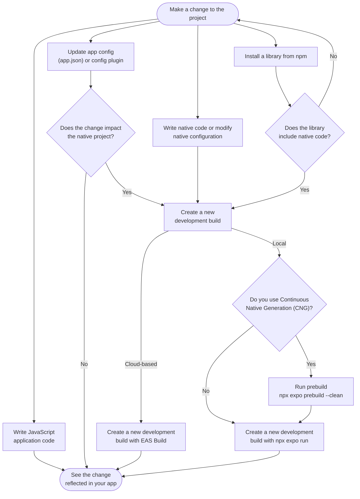

# When to Rebuild an Expo App

This skill answers one question that comes up constantly in the Expo development loop:

> **I changed something — will it just show up, or do I need a new native build?**

The mental model is a single boundary: **JavaScript vs. native.**

- **JavaScript changes** (app code, JS-only libraries) are picked up instantly by Metro and Fast Refresh. **No build needed.**
- **Native changes** (native code, config plugins, app-config properties that touch the native project, libraries with native code) are compiled into the binary — native modules are linked in at build time via autolinking, so a JS reload can't pick them up. They require **a new development build.**

Most changes are JavaScript, so most of the time the answer is "no build needed." A new build is the exception, triggered only when you cross into native. This boundary is also the line between **Expo Go and a development build**: Expo Go bundles a fixed set of native modules, so as soon as your change needs custom native code, you move to a development build — and rebuild whenever the native side changes.

## The core development loop

## Quick decision: does my change need a new build?

| You changed… | New build? | What to do |
|---|---|---|
| JavaScript / TypeScript app code | **No** | Save — Fast Refresh shows it instantly |
| A JS-only npm library (no native code) | **No** | Import and use it; keep coding |
| `app.json` / `app.config.js` — values read at runtime via `expo-constants` (e.g. `extra`) | **No** | Updates on reload in dev; embedded at build time for production |
| `app.json` / `app.config.js` — anything that maps to native (app name, icon, splash, bundle/package id, permissions, `scheme`, orientation, plugins) | **Yes** | Rebuild |
| Added or changed a **config plugin** | **Yes** | Rebuild |
| Wrote **native code** (Swift/Kotlin) or a local Expo Module | **Yes** | Rebuild |
| Installed an npm library that **includes native code** or ships a config plugin | **Yes** | Rebuild |
| Bumped the Expo SDK / upgraded native dependencies | **Yes** | Rebuild (see [upgrading-expo](../upgrading-expo/SKILL.md)) |

"Rebuild" here means **create a new development build** — locally or with EAS. The first time it is a *build*; every time after a native change it is a *rebuild*.

> Rule of thumb: if the change only touches files Metro bundles (JS/TS, assets imported from JS), no build. If it changes what the compiler sees (native code, native config, native dependencies), rebuild. When in doubt about an app-config change, rebuild — most app config maps to native settings.

## Creating a build: local vs. cloud (EAS)

Once you know a build is required, choose where it runs:

- **Cloud — EAS Build** (`eas build --profile development`): builds on Expo's servers. No Xcode or Android Studio required, works the same on every machine, and is the right choice for teams and CI. This is the recommended default.
- **Local** (`npx expo run:ios` / `npx expo run:android`, or `eas build --local`): compiles on your machine. Faster iteration if you already have the native toolchains installed, and works offline.

For the mechanics of creating and distributing the build (EAS profiles, TestFlight, installing on devices), see [expo-dev-client](../expo-dev-client/SKILL.md).

## CNG and prebuild

**Continuous Native Generation (CNG)** means the `android` and `ios` native projects are *generated on demand* from your `app.json`/`app.config.js` and `package.json` — the same way `node_modules` is generated from `package.json`. A fresh `npx create-expo-app` has **no** `android`/`ios` directories by default; that is CNG.

`npx expo prebuild` generates those native directories and applies your app config to them. With CNG you treat the native projects as build artifacts, not source you edit by hand.

### When do I need to run prebuild again?

Run prebuild again whenever a change affects the native project:

- App-config **native properties** (icon, splash, permissions, bundle id, plugins…)
- A **config plugin** added or changed
- A **native dependency** added, removed, or upgraded

> [!IMPORTANT]
> Running `npx expo prebuild` again **layers** changes on top of the existing native files and can produce inconsistent results. To keep prebuild deterministic:
>
> 1. Keep `android` and `ios` out of version control — in a CNG project they're git-ignored by default; treat them as build artifacts.
> 2. Always regenerate from scratch with **`npx expo prebuild --clean`**.

If instead you commit and hand-edit `android`/`ios` yourself (you are not using CNG), skip prebuild and build directly with `npx expo run`.

### Note on `npx expo run`

`npx expo run:ios` / `npx expo run:android` generate the native directories *before* compiling. After that first build, **JavaScript changes do not need a rebuild** — Metro and Fast Refresh handle them. Only native code, native config, or native dependency changes require you to rebuild.

## Related skills

- **[expo-dev-client](../expo-dev-client/SKILL.md)** — *how* to create and distribute a development build (EAS profiles, TestFlight, installing locally). This skill tells you *whether and which*; that one tells you *how*.
- **[expo-module](../expo-module/SKILL.md)** — writing native modules and config plugins (the changes that force a rebuild).
- **[upgrading-expo](../upgrading-expo/SKILL.md)** — SDK upgrades also require `prebuild --clean` and a rebuild.
- **[expo-cicd-workflows](../expo-cicd-workflows/SKILL.md)** — automate builds in CI with EAS Workflows.

## References

- [Develop an app with Expo](https://docs.expo.dev/workflow/overview/) — the core development loop
- [Continuous Native Generation (CNG)](https://docs.expo.dev/workflow/continuous-native-generation/)
- [Configure with app config](https://docs.expo.dev/workflow/configuration/)
- [Using libraries](https://docs.expo.dev/workflow/using-libraries/)
- [Development builds: introduction](https://docs.expo.dev/develop/development-builds/introduction/)
